RUMI EXTENSION Beta Proto V0.5 — COMPREHENSIVE TESTING GUIDE
Last Edit Jan 11, 2025 8:45 PM EST
Overview
This guide provides comprehensive testing coverage for the Rumi Extension Prototype V0, including both main application flows and individual component testing. 

The guide is organized into two main sections:
1. **Main Application Testing Flows** - Six progressive testing flows that build your understanding of how content detection, indexing, and the point system works
2. **Micro-Test Suite** - Standalone component tests for individual system functionality

Use this guide to simulate real user behavior and test all key features of the extension.

## 🎯 Main Application Flow Overview

```mermaid
graph TD
    A["🚀 Launch Interface"] --> B["📱 Activate Extension"]
    B --> C{"Entry Point Choice"}
    C --> D["🎬 Stream Detected<br/>(Casual Watching)"]
    C --> E["⚡ Automode Campaign<br/>(Miners)"]
    
    D --> F["🎯 Content Detection Mode"]
    E --> G["🤖 Auto Mode"]
    
    F --> H["🎮 Genre Channel<br/>Selection"]
    F --> I["▶️ Start Indexing"]
    
    G --> J["🧠 Learning Buckets<br/>Selection"]
    G --> K["🔄 Help RUMI Learn"]
    
    H --> L["⚙️ Customize Content"]
    I --> M["📊 Live Progress<br/>Tracking"]
    K --> N["📈 Higher Rate<br/>Indexing"]
    
    L --> M
    M --> O["⏹️ Stop Indexing"]
    N --> P["⏹️ Stop Learning"]
    
    O --> Q["🧾 Session Receipt"]
    P --> Q
    
    Q --> R["💎 Points Validation<br/>(24hr pending)"]
    R --> S["✅ Lifetime Points<br/>Updated"]
    
    style A fill:#e1f5fe
    style B fill:#f3e5f5
    style D fill:#e8f5e8
    style E fill:#fff3e0
    style Q fill:#f1f8e9
    style S fill:#e8f5e8
```

## 🧪 Micro-Test Suite Architecture

```mermaid
graph TD
    A["🧪 Micro-Test Suite"] --> B["💎 Progress Diamonds"]
    A --> C["📱 Popup System"]
    A --> D["🧠 Intelligence Buckets"]
    A --> E["🔢 Multiplier Calculator"]
    A --> F["🔄 Section Transitions"]
    A --> G["📊 CSV Processing"]
    A --> H["💰 Points Calculation"]
    A --> I["🔗 Component Communication"]
    
    B --> B1["Diamond States<br/>Color Changes<br/>Animations"]
    C --> C1["Popup Types<br/>Positioning<br/>Content Display"]
    D --> D1["Content Categories<br/>Filtering<br/>Statistics"]
    E --> E1["Time Calculations<br/>Multipliers<br/>Edge Cases"]
    F --> F1["UI States<br/>1→2a/2b→3a/3b<br/>Branch Logic"]
    G --> G1["CSV Upload<br/>Data Parsing<br/>Export"]
    H --> H1["Parameter Testing<br/>Scenarios<br/>Breakdowns"]
    I --> I1["Message Passing<br/>State Sync<br/>iframe Communication"]
    
    J["🎯 Test Coverage: 80%<br/>8/10 Tests Complete"]
    
    style A fill:#e3f2fd
    style B fill:#e8f5e8
    style C fill:#f3e5f5
    style D fill:#fff3e0
    style E fill:#fce4ec
    style F fill:#e0f2f1
    style G fill:#f1f8e9
    style H fill:#e8eaf6
    style I fill:#fff8e1
    style J fill:#ffebee
```

Important Notes:
Hard refresh the page at any time to start over (command+shift+R)
After refreshing, you must click the blue activation circle after clicking any entry point to simulate clicking the browser extension.
For more visuals we have explored for check this link (which also has our brand kit)
Flow 1: Open the Interface and Activate It
Purpose: Launch the interface and simulate extension activation.
What You'll Learn:
How users typically enter the experience
What the "SIMULATED ENTRY POINTS" panel does
Why the activation step is required
The difference between extension activation and automode launch

Steps:
Click the link (same as above)
Locate the "SIMULATED ENTRY POINTS." panel, this represents the main two ways we expect people to enter the extension
Via recognizing that something is playing in a window (casual watching(
Via a superuser invite link / marketing campaign (miners)
Click the top Stream Detected button  - it shows a button that says “ "Launch Rumi and Get Points.” It is meant to represent a pop-up that appears when content is detected playing from Netflix and should be populated with a show or movie title.
This represents the movie that has been “detected” from a streaming service but likely will not be visible on the popup in production. Its there as a way to show the thread of content without having to have a video in this prototype.
Click the glowing blue activation circle at the top-center of the screen.
This simulates clicking the browser extension icon - which users are required to do the first time they index a session after launching the extension.
“Content Detected Detected” intexing interface should now appear in the center of the screen.
You will see a header with RUMI logo and settings button
Message bar
Points header which shows your lifetime points and how many points that are pending today (pending points are processed and released the next day at noon)
Collapsable leaderboard
Start indexing button with the name of the show that was recognized
Dropdown menu to see the genre channel if users want to watch with us (more on that later)
Click the leaderboard to check out where you are relative to the rest of the community
Click settings to see how the message panel expands from the message bar
If you want to see what happens when we index, click start watching, but we will cover that next.
If youd like to quickly try Automode, refresh your browser and click the "Automode Campaign" button if you’d like.
Additional Details:
The debug panel includes an array of debug features, most which you will not need and we need to clean out.
Flow 2a: Index a Session with Content Detection Mode
Purpose: Simulate a complete indexing session.
What You'll Learn:
How indexing sessions are started/stopped
Where live progress appears during indexing
That indexing enables point accumulation
How the UI transforms during active indexing

Steps (following the “ "Launch Rumi and Get Points.” entry point in the first call to action)
Toggle down “Watch Your Next Show with Us” to see the Genre Channel.
The Genre of the channel and the show detected should match.
You should see how mich time you can index for and the multipliers associated with
You should see the whole channel populated with shows or movies in that genre following the one you are watching. 
You should not be able to over over and remove the item you are watching
Toggle the menu back up, we’ll cover it later
Click "START WATCHING __________"
The button text should be the detected content from the first screen (e.g., "START WATCHING The Office S1E1").
Wait a few seconds. You'll see The interface switches to "indexing mode" with different elements:
A green ASCII-style animation panel showing a placeholder data vis for indexing progress and the title of the show/what part we are learning about
A horizontal progress bar with glints representing multipliers
These glints align with those in the channel timeline ui
A "STOP INDEXING ______ " button replacing the start button
The same drop-down menu with the same content channel as in the previous step
Observe the UI updating as time progresses:
Points accumulate in real-time
Session duration is tracked
Content channels can be modified and content can be customized if the user wants to watch something else with rumi next.
Click "STOP INDEXING" to end the session.
The UI takes us to the receipt view, showing point and session info
First, your points earned, and how many you have pending for the day (we will release all content from the day in 24 hours, not sure how midnight will work yet).
Breakdown of how the points were earned
Breakdown of what you watched and what you earned
Reminder of 24 hour pending points processing
Clicking Done takes you to the ‘start indexing screen where you began’ or you can view one of our channels or if you’re watching Netflix, a pop up will appear for you to start again
Your points pending for the day should be updated from this session
Flow 2b: Index a Session with Auto Mode
(follow “Automode Campaign” entry point in the first screen, press blue circle) 
Toggle down “What are we Learning” to see the “Rumi Channel”. This channel delivers buckets of content to our users to understand specific things about content. You will see
The part of RUMI you are helping with (EG: Content Intelligence), how many clips there are, and the total time and points.
Youll see specific things that it is helping with like “metadata processing, and what that means”.
When you over over the block (eg: Content intelligence) you should see which parts we are learning about with which shows
You should see a cycle bucket button, when pressed - rotates through the different buckets of content you can help with (this will be done automatically and is just for demonstration)
Click "Help RUMI Learn about “__________"
The button text match the name of the block of content in the channel.
Wait a few seconds. You'll see The interface switches to "indexing mode" with different elements:
A yellow ASCII-style animation panel showing a placeholder data vis for indexing progress and the name of the show/what part we are learning about
A horizontal progress bar with glints representing multipliers
These glints align with those in the channel timeline ui
A "STOP INDEXING ______ " button replacing the start button
The same drop-down menu with the same content channel as in the previous step
Observe the UI updating as time progresses:
Points accumulate in real-time (at a higher rate)
Session duration is tracked
Content channel is accessible but can not be modified. Its more to learn about subdetail if the superuser wants.
Click "STOP INDEXING" to end the session.
The UI takes us to the receipt view, showing point and session info
First, your points earned, and how many you have pending for the day (we will release all content from the day in 24 hours, not sure how midnight will work yet).
Breakdown of how the points were earned
Breakdown of what you watched and what you earned
Reminder of 24 hour pending points processing
Clicking Done takes you to the ‘start indexing screen where you began’

Flow 3: Use the Genre Menu
Purpose: Explore genre-based browsing.
What You'll Learn:
How show detection banners behave
How to explore the genre menu and content channels
The difference between detected content and channel browsing

Steps:
Refresh the screen and click "Launch Rumi and Get Points."
Toggle down “Watch Your Next Show with Us” to see the Genre Channel.
The Genre of the channel and the show detected should match.
Click Edit Genre and pick a different genre
Click Auto Populate
The timeline (other than what you are watching) should fill with content in the selected genre
Remove the last item or two by hovering over them and clicking the red x
They should go away
Add a new piece of content by pressing the plus button 
Select something from the dropdown and then confirm with ADD
Content should now be in the timeline.
Press start watching
The content should go into index mode and persist in the channel
Flow 4: View Points and Session Receipt
Purpose: Review how points are earned and what your session generated.
What You'll Learn:
What pending points mean and how they're calculated
How bonuses and multipliers affect point totals
Where to view indexed content history
The detailed breakdown of session rewards

## 💰 Points Calculation System

```mermaid
graph TD
    A["⏰ Base Time"] --> B["🔢 Base Rate<br/>(0.5 pts/5s)"]
    B --> C["✨ Multiplier System"]
    
    C --> D["🎬 Content Type<br/>Multiplier"]
    C --> E["🔗 Chain Bonus<br/>(+0.1 per switch)"]
    C --> F["🎯 Special Events<br/>Bonus"]
    
    D --> G["📺 Standard: 1.0x<br/>🎪 Premium: 1.5x<br/>🎭 Documentary: 2.0x<br/>🌟 Trending: 2.5x"]
    
    E --> H["📱 Show Interrupt<br/>Continue = +0.1x"]
    F --> I["🎉 Daily Bonus<br/>🎁 Event Bonus"]
    
    G --> J["💎 Points Calculation"]
    H --> J
    I --> J
    
    J --> K["⏳ Session Duration<br/>× Base Rate<br/>× Total Multiplier<br/>+ Bonus Points"]
    
    K --> L["🔄 Real-time Updates"]
    L --> M["📊 Session Receipt"]
    
    M --> N["⏱️ Pending Points<br/>(24hr validation)"]
    N --> O["✅ Lifetime Points<br/>(next day)"]
    
    style A fill:#e3f2fd
    style B fill:#e8f5e8
    style C fill:#fff3e0
    style J fill:#f3e5f5
    style K fill:#fce4ec
    style M fill:#e0f2f1
    style O fill:#e8eaf6
```

Steps:
If not already active, click "START WATCHING" and let it run for at least 30 seconds, check out the realtime counters on the screen during indexing
Open the Debug Panel.
Under "Session Management," click "Test End-of-Content Receipt."
The screen will display a detailed session receipt showing:
Total points earned during the session
Session duration (formatted as minutes:seconds)
The multiplier used to boost point earnings (varies by content type)
Any bonus that was applied (daily bonuses, special events)
Base rate information (0.5 pts/5s)
Indexed content summary with auto-scrolling list if multiple items
Next steps explaining point validation timeline
Review the "NEXT STEPS" section explaining the 24-hour validation window.
Click "DONE" to return to the main view.

Additional Details:
Points are calculated using a base rate with dynamic multipliers based on content type and user engagement
The receipt shows comprehensive tracking data that would be stored for analytics.
Flow 5: Understand Point Statuses and Simulate Validation
Purpose: Clarify the difference between pending and lifetime points and simulate daily point finalization.
What You'll Learn:
What "pending points" are and how they accumulate
How and when they convert to lifetime points
Where to monitor your point accumulation throughout the day
The validation and cooldown system

Steps:
After completing a session, look at the main screen display:
Lifetime Points (top line): your total points confirmed from all previous days.
+___ Pending from Today (below): these are points earned today, awaiting validation.
These points are usually finalized and added to your lifetime total within 24 hours.
Open the Debug Panel.
Under "Session Management," click "Skip to Tomorrow."
This simulates a new day and triggers point validation.
Your pending points should now be added to your lifetime points.
The button will enter a cooldown state to prevent spam clicking.
Run additional sessions and observe how today's points accumulate after each one.
Test the debug button "Fast Mode (10s)" button when you are indexing accelerate session timing for faster testing.

Additional Details:
The point system includes built-in cooldowns and validation checks.
Fast mode compresses normal timing intervals for efficient testing it is buggy and improving by 6.25
All point movements are logged for debugging and analytics.

Flow 6: Test Error States, Breakpoints, and Settings
Purpose: Test how Rumi handles system errors and adapts to different screen sizes.
What You’ll Learn:
How system errors are communicated to users
How the UI responds at different vertical screen sizes
How layout constraints and overflow are handled
Part A: Trigger and Dismiss System Errors
Open the Debug Panel using the gray “Debug” button in the bottom-left corner.
Find the section labeled “Error Testing.”
Click the following options one at a time:
Volume Error
System Error
Network Error
etc.
Each will display a banner notification at the top of the popup.
A short message is visible by default.
Ability to ‘resume” which also simulates the error being fixed
The indexing animations and counters will pause and turn grey
If the error is non fatal, resume the session and the counters, animations, and colors should restore to their original states

Tips for Observing Behavior:
Make sure messages layer above content and animate smoothly.
Test multiple errors in a row to ensure stack or overwrite behavior is consistent.
Some errors are fatal and you have to end the session where you go to a receipt
Other errors are not and let you resume where you stopped
Part B: Check Settings and Simulate Screen Height Constraints 🚧
Click the settings button in the header. 
Check to make sure the message panel expands properly
See if you can change a setting or two then press save or cancel (it should have no bearing on your experience) 
In the Debug Panel, find the “Vertical Breakpoints” section.
Click through each screen height setting to test layout responsiveness:
Very Short (400px) 
Short (600px)
Standard (800px)
Tall (1100px)

What to Look For:
Does the layout compress or clip text?
Do scroll behaviors activate when needed?
Does spacing/margin collapse appropriately on smaller sizes?
Are UI elements like “Start Watching,” error messages, and debug buttons still accessible?

Tip: Combine this with other active states like:
Show detection banners
Session receipts
Indexing
Leaderboard cards

Flow 7: Session Interruption + Chaining

Steps: simulate one of our most common scenarios where users switch between shows during indexing sessions and testing the system's ability to accommodate it coherently.
You must have an active indexing session running before testing interruptions
All testing is performed via the Debug Panel located at the bottom-left of the interface
Part 1: Basic Session Interruption Setup
Locate the gray "Debug" button in the bottom-left corner of the screen
Click it to open the debug panel (it slides up from the bottom)
Navigate to the "Error Testing" section by clicking its header
Expand it if not already expanded (look for the ▼ arrow)

Part 2: Simulate a Show Interrupt
Ensure indexing is active (green animation panel visible)
In the Debug Panel, locate the "Error Testing" section
Click "Show Interrupt" button
Observe the interrupt behavior:
Indexing pauses automatically
An error message appears asking about content change
Two options appear: "YES, CONTINUE" and "NO, END SESSION"
Part 3. Test Chaining by Continuing with New Content
Click "YES, CONTINUE" when prompted about the content change
Watch the system behavior:
Indexing resumes automatically
The multiplier increases (adds +0.1 chain bonus)
Original show data is preserved for receipt
System tracks the transition timestamp
3. Verify chaining is active:
Points continue to accumulate
Correct show data is displayed
The session now includes multiple content items
Multiplier shows increased value (e.g., 1.1x instead of 1.0x)

Part 3: Testing Multiple Interruptions and Advanced Scenarios
To test handling of multiple content switches in one session:
While still indexing (after first interrupt), wait 30-60 seconds
Click "Show Interrupt" again in the Error Testing section
Choose "YES, CONTINUE" again
Observe:
Multiplier increases again (+0.1 for each successful chain)
System tracks each transition timestamp
Points continue accumulating with higher multiplier
Key Concepts Recap
Lifetime Points: confirmed, validated points from previous sessions and days.
Pending Points: points earned today that are not added to your lifetime total until validated (usually within 24 hours).
Today's Points: shown as "+___ pending from today." This number increases every time you index content.
Session Management: comprehensive tools for simulating various user scenarios and time-based events.
Fast Mode: accelerated testing mode that compresses normal timing intervals.
Cooldowns: built-in rate limiting to prevent abuse of debug functions.

Micro-Test Suite: Component Testing Guide
The micro-test suite provides standalone testing for individual system components. Each test can be run independently to verify specific functionality without the full application context.

How to Use Micro-Tests:
1. Navigate to the microtests directory
2. Open any standalone test file directly in your browser (no server required)
3. Each test includes its own instructions and interactive elements
4. Tests are self-contained and don't affect each other

Available Micro-Tests:

Progress Diamonds Test (progress-diamonds-standalone.html)
Purpose: Test the diamond progression system and visual feedback
What to Test:
- Click through different progress levels
- Verify color changes and animations
- Test multiplier effect calculations
- Check diamond state persistence

Popup System Test (popup-system-standalone.html)
Purpose: Test information popups and content display
What to Test:
- Trigger different popup types
- Test popup positioning and sizing
- Verify content loading and display
- Test dismiss functionality

Intelligence Buckets Test (intelligence-buckets-standalone.html)
Purpose: Test content categorization and filtering
What to Test:
- Assign content to different buckets
- Test filtering by category
- Verify bucket statistics
- Test export functionality

Multiplier Calculator Test (multiplier-calc-standalone.html)
Purpose: Test point calculation logic
What to Test:
- Input different time values
- Verify multiplier calculations
- Test edge cases and limits
- Check calculation accuracy

Section Transitions Test (section-transitions-standalone.html)
Purpose: Test UI state transitions between sections
What to Test:
- Navigate between sections (1 → 2a/2b → 3a/3b)
- Test branch selection logic
- Verify state preservation
- Check transition animations

CSV Processing Test (csv-processing-standalone.html)
Purpose: Test data import and processing
What to Test:
- Upload CSV files via drag & drop
- Test data parsing and validation
- Verify filtering and search
- Test data export functionality

Points Calculation Test (points-calculation-standalone.html)
Purpose: Test comprehensive point calculation scenarios
What to Test:
- Use sliders to adjust parameters
- Test predefined scenarios
- Verify calculation breakdowns
- Check bonus point logic

Running Individual Tests:
1. Open the desired test file in your browser
2. Follow the on-screen instructions
3. Use the interactive controls to test different scenarios
4. Check the console for any errors or debug information
5. Reset the test using the provided reset buttons

Debug Panel Reference: 
The Debug Panel provides testing tools organized into sections:

## 🔧 Debug Panel & Testing Features

```mermaid
graph TD
    A["🔧 Debug Panel"] --> B["🔍 Basic Testing"]
    A --> C["❌ Error Testing"]
    A --> D["⚙️ Session Management"]
    A --> E["📱 Vertical Breakpoints"]
    
    B --> B1["Show Tracker<br/>Show State<br/>Analytics Data"]
    
    C --> C1["🔊 Volume Error<br/>🌐 Network Error<br/>💻 System Error"]
    C --> C2["🎬 Show Interrupt<br/>Resume/End Options"]
    C --> C3["🔄 Chaining Logic<br/>Multiple Switches"]
    
    D --> D1["⚡ Fast Mode<br/>(10s acceleration)"]
    D --> D2["📅 Skip to Tomorrow<br/>(Point validation)"]
    D --> D3["🧾 End-of-Content<br/>Receipt"]
    
    E --> E1["📏 400px - Very Short<br/>📐 600px - Short<br/>📊 800px - Standard<br/>📈 1100px - Tall"]
    
    F["🎯 Testing Scenarios"]
    F --> G["🔄 Error Recovery"]
    F --> H["📱 Responsive Design"]
    F --> I["⏱️ Time Simulation"]
    F --> J["🎬 Content Switching"]
    
    style A fill:#e3f2fd
    style C fill:#ffebee
    style D fill:#e8f5e8
    style E fill:#fff3e0
    style F fill:#f3e5f5
```

Basic Testing
Show Tracker - View detailed analytics data
Show State - Inspect current application state

Error Testing
Volume/Speed/Language Errors - Simulate playback issues
System/Network/Browser Errors - Test error handling
Show Interrupt - Simulate content interruption

Session Management
Fast Mode - Accelerate session timing for testing (UNDER CONSTRUCTION)
Skip to Tomorrow - Simulate point validation and new day
Debug Content Tracking - Inspect content detection
Test End-of-Content Receipt - View session completion details
Debug Show Detection - Trigger show detection banner

Vertical Breakpoints
Test UI responsiveness at different screen heights
Simulate various viewport sizes

Reset Instructions
To reset the interface:
Refresh the page in your browser.
Click the blue activation circle to re-launch the extension popup.
All state will be reset to initial conditions.

Scraps
Additional Details:
Show detection simulates real-world scenarios where the extension identifies what you're watching.
The genre menu loads actual channel interfaces that demonstrate content discovery features.

