# RUMI EXTENSION Beta Proto V1.0 — COMPREHENSIVE TESTING GUIDE
*Last Updated: July 11, 2025*

---

## 📋 Overview

This guide provides comprehensive testing flows for the Rumi Extension Prototype V1.0, featuring enhanced UI sections, dynamic progress bars, intelligence bucket systems, and robust content detection. The prototype simulates a browser extension that rewards users for "indexing" streaming content through two distinct pathways: **Content Detection Mode** (casual users) and **Automode** (power users/miners).

### 🏗️ Architecture Overview

The system operates through five main UI sections:

- **Section 1**: Entry point selection and activation
- **Section 2a**: Detection mode setup and configuration  
- **Section 2b**: Automode setup and intelligence bucket selection
- **Section 3a**: Detection mode indexing with green-themed UI
- **Section 3b**: Automode indexing with yellow-themed UI

---

## 🔧 Important Setup Notes

- **Hard refresh** the page anytime to reset (Cmd+Shift+R / Ctrl+Shift+R)
- **Must click the blue activation circle** after any entry point to simulate extension activation
- **Server**: Run on `http://localhost:8000` or similar local server
- **Browser**: Modern browser with JavaScript enabled

## 🏗️ System Architecture Diagrams

### UI Flow Architecture

```mermaid
graph TD
    A["🎯 Entry Points<br/>Section 1"] --> B["🔍 Stream Detected<br/>Entry Point"]
    A --> C["⚡ Automode Campaign<br/>Entry Point"]
    
    B --> D["🎬 Section 2a<br/>Content Detection Mode<br/>(Green Theme)"]
    C --> E["🧠 Section 2b<br/>Automode Selection<br/>(Yellow Theme)"]
    
    D --> F["🎮 Section 3a<br/>Detection Indexing<br/>(Green Progress)"]
    E --> G["⛏️ Section 3b<br/>Automode Indexing<br/>(Yellow Progress)"]
    
    F --> H["📊 Session Complete<br/>Receipt & Points"]
    G --> I["💎 Enhanced Receipt<br/>Miner Bonuses"]
```


### Progress Bar Diamond System

```mermaid
graph LR
    A["🚀 Start Session<br/>1.0x Base"] --> B["⏱️ 12 minutes<br/>Orange Diamond<br/>1.5x Multiplier"]
    B --> C["⏱️ 24 minutes<br/>Red-Orange Diamond<br/>2.0x Multiplier"]
    C --> D["⏱️ 36 minutes<br/>Purple Diamond<br/>2.5x Multiplier"]
    D --> E["⏱️ 48 minutes<br/>Cyan Diamond<br/>3.0x Multiplier"]
    E --> F["⏱️ 60+ minutes<br/>Magenta Diamond<br/>3.5x+ Multiplier"]
    
    subgraph "Detection Mode"
        G["🟢 Green Progress Bar<br/>Base: #00ff41"]
        H["📊 Points: 0.1 pts/5s"]
    end
    
    subgraph "Automode"
        I["🟡 Yellow Progress Bar<br/>Base: #ffff00"]
        J["📊 Points: 0.12 pts/5s"]
    end
```


### Intelligence Bucket System


```mermaid
graph TD
    A["🧠 Intelligence Buckets<br/>Selection Required"] --> B["🔍 Content Intelligence<br/>Metadata Processing"]
    A --> C["🎯 Pattern Recognition<br/>Narrative Analysis"]
    A --> D["📊 Behavior Analysis<br/>User Engagement"]
    A --> E["🏷️ Classification Systems<br/>Genre Categorization"]
    
    B --> F["💬 Enhanced Popup<br/>Learning Category<br/>Total Content: 15 clips • 35 min<br/>Estimated Points: 520<br/>Current Multiplier: 1.2x"]
    C --> G["💬 Enhanced Popup<br/>Learning Category<br/>Total Content: 12 clips • 28 min<br/>Estimated Points: 445<br/>Current Multiplier: 1.1x"]
    D --> H["💬 Enhanced Popup<br/>Learning Category<br/>Total Content: 18 clips • 42 min<br/>Estimated Points: 630<br/>Current Multiplier: 1.3x"]
    E --> I["💬 Enhanced Popup<br/>Learning Category<br/>Total Content: 14 clips • 31 min<br/>Estimated Points: 495<br/>Current Multiplier: 1.2x"]
    
    F --> J["⚡ Launch Campaign<br/>Automode Indexing"]
    G --> J
    H --> J
    I --> J
```

## 🧪 Micro-Concept Test Suite

Before diving into the full integration tests, explore individual components with our **Micro Test Suite**:

### 🔗 Available Micro Tests

1. **🔷 Progress Bar Diamond System** (`microtests/progress-diamonds-standalone.html`)
   - Interactive diamond progression demonstration
   - Color transition testing
   - Multiplier milestone visualization
   - Detection vs Automode comparison

2. **💬 Popup Information System** (`microtests/popup-system-standalone.html`)
   - Content metadata popup testing
   - Intelligence bucket information display
   - Theme-aware popup styling
   - Interactive popup triggers

3. **📊 Multiplier Calculation** (`microtests/multiplier-calc-standalone.html`)
   - Interactive multiplier calculator
   - Time scenario testing
   - Points calculation breakdown
   - Timeline visualization

### 🚀 Accessing Micro Tests

- **Direct Access**: Open `microtests/index.html` for the complete test suite
- **Individual Tests**: Navigate directly to specific test files
- **Integration**: Use micro tests to understand components before full system testing

These micro tests provide isolated testing environments similar to `asciiartstuff/ascii-shapes-standalone.html`, allowing you to understand individual components without the complexity of the full system.

---

## 🎯 Test Flow 1: Interface Launch & Activation

**Purpose**: Understand entry points and activation flow  
**Time**: 2-3 minutes  
**Skills**: Basic UI navigation  

### What You'll Learn:
- Two main user entry pathways
- Extension activation simulation
- UI state management
- Entry point validation

### Steps:

1. **Navigate to the Interface**
   - Open `http://localhost:8000/reference-index.html`
   - Locate the "SIMULATED ENTRY POINTS" panel

2. **Test Content Detection Entry**
   - Click **"Stream Detected"** button
   - Observe the detected content banner (simulates Netflix/streaming detection)
   - Note the "Launch Rumi and Get Points" button with detected show title

3. **Test Automode Entry**
   - Refresh page
   - Click **"Automode Campaign"** button
   - Observe the campaign interface for power users/miners

4. **Activation Simulation**
   - Click the **glowing blue activation circle** at top-center
   - This simulates clicking the browser extension icon
   - UI should transition to active state

### Expected Results:
- ✅ Entry point buttons respond correctly
- ✅ Blue activation circle appears and functions
- ✅ UI transitions smoothly between states
- ✅ Detected content appears in banners

---

## 🎯 Test Flow 2a: Content Detection Mode (Casual Users)

**Purpose**: Complete detection mode indexing session  
**Time**: 5-7 minutes  
**Skills**: Content selection, session management  

### What You'll Learn:
- Genre channel system
- Content customization
- Detection mode indexing
- Progress tracking with green theme

### Steps:

1. **Setup Detection Mode**
   - Follow Flow 1 using "Stream Detected" entry
   - Ensure you're in Section 2a (green-themed interface)

2. **Explore Genre Channel**
   - Toggle down **"Watch Your Next Show with Us"**
   - Verify genre matches detected content
   - Review timeline showing session duration and multipliers
   - Note: Currently watching item cannot be removed

3. **Customize Content Channel**
   - Click **"Edit Genre"** 
   - Select different genre from dropdown
   - Click **"Auto Populate"** to fill timeline
   - Remove items by hovering and clicking red X
   - Add items using + button and dropdown selection

4. **Start Indexing Session**
   - Click **"START WATCHING [Content Name]"**
   - UI transitions to Section 3a (active indexing)
   - Observe green ASCII animation panel
   - Monitor real-time points accumulation

5. **Monitor Progress Elements**
   - **Progress Bar**: Green base with colored diamond multipliers
   - **Points Display**: Real-time session points @ current multiplier
   - **Animation Panel**: Content-specific ASCII visualizations
   - **Timeline**: Glints align with progress milestones

6. **End Session**
   - Click **"STOP INDEXING"**
   - Review receipt showing:
     - Total points earned
     - Session duration
     - Multiplier breakdown
     - Pending points (24-hour validation)
   - Click **"DONE"** to return to main interface

### Expected Results:
- ✅ Genre channel loads correctly
- ✅ Content customization works
- ✅ Green progress bar with unique diamond colors
- ✅ Real-time points calculation
- ✅ Proper session receipt generation

---

## 🎯 Test Flow 2b: Automode (Power Users/Miners)

**Purpose**: Complete automode indexing with intelligence buckets  
**Time**: 5-7 minutes  
**Skills**: Intelligence bucket selection, advanced features  

### What You'll Learn:
- Intelligence bucket system
- Enhanced point rates
- Automode validation requirements
- Yellow-themed power user interface

### Steps:

1. **Setup Automode**
   - Follow Flow 1 using "Automode Campaign" entry
   - Ensure you're in Section 2b (yellow-themed interface)

2. **Explore Intelligence Buckets**
   - Toggle down **"What Are We Learning"**
   - Review available intelligence buckets:
     - Content Intelligence
     - Pattern Recognition  
     - Behavior Analysis
     - Classification Systems
   - Hover over buckets to see detailed information

3. **Intelligence Bucket Selection**
   - **Important**: Notice launch button is disabled initially
   - Select an intelligence bucket from dropdown
   - Observe button becomes enabled: **"Launch Campaign"**
   - Click **"Cycle Bucket"** to see different options

4. **View Enhanced Popup Information**
   - Click on intelligence bucket block
   - Popup displays:
     - Learning Category (e.g., "Metadata Processing")
     - Description of bucket purpose
     - Total Content (clips • duration)
     - Estimated Points (with base rate)
     - Current Multiplier
     - Current Content examples

5. **Start Automode Indexing**
   - Click **"Launch Campaign"**
   - UI transitions to Section 3b (yellow-themed)
   - Observe yellow ASCII animation panel
   - Monitor enhanced point rates

6. **Monitor Enhanced Features**
   - **Progress Bar**: Yellow base with unique diamond colors
   - **Points Display**: Higher rate accumulation
   - **Learning Dashboard**: Real-time AI training simulation
   - **Read-only Channel**: Information display only

7. **End Session**
   - Click **"STOP INDEXING"**
   - Review enhanced receipt with:
     - Higher point totals
     - Intelligence contribution metrics
     - AI training progress
     - Miner-specific bonuses

### Expected Results:
- ✅ Intelligence bucket selection required
- ✅ Enhanced popup information system
- ✅ Yellow progress bar with unique colors
- ✅ Higher point accumulation rates
- ✅ Miner-specific UI elements

---

## 🎯 Test Flow 3: Progress Bar Diamond System

**Purpose**: Understand the enhanced progress bar mechanics  
**Time**: 10-15 minutes  
**Skills**: Visual observation, timing analysis  

### What You'll Learn:
- Unique diamond colors for each multiplier
- Progress bar color transitions
- Multiplier milestone system
- Visual feedback mechanisms

### Steps:

1. **Test Detection Mode Progress Bar**
   - Start detection mode session
   - Observe initial green progress bar
   - Watch for first diamond appearance
   - Note color palette:
     - Bright Green (#00ff41) - Base
     - Orange (#ffaa00) - 1.5x
     - Red-Orange (#ff6600) - 2.0x
     - Purple (#a985ff) - 2.5x
     - Cyan (#00ccff) - 3.0x
     - Magenta (#ff00ff) - 3.5x+

2. **Test Automode Progress Bar**
   - Start automode session
   - Observe initial yellow progress bar
   - Watch for first diamond appearance
   - Note color palette:
     - Bright Yellow (#ffff00) - Base
     - Orange (#ffaa00) - 1.5x
     - Red-Orange (#ff6600) - 2.0x
     - Purple (#a985ff) - 2.5x
     - Cyan (#00ccff) - 3.0x
     - Magenta (#ff00ff) - 3.5x+

3. **Observe Color Transitions**
   - Watch progress bar change color when passing diamonds
   - Note enhanced glow effects on diamonds
   - Observe pulsing animation on active diamonds
   - See preview colors on unfilled diamonds

4. **Test Fast Mode** (Debug Panel)
   - Open debug panel
   - Enable "Fast Mode" to accelerate timing
   - Observe rapid diamond transitions
   - Verify color changes occur correctly

### Expected Results:
- ✅ Each diamond has unique color
- ✅ Progress bar adopts diamond colors
- ✅ Smooth color transitions
- ✅ Enhanced visual effects (glow, pulse)
- ✅ Preview colors on future diamonds

---

## 🎯 Test Flow 4: Content Channel Management

**Purpose**: Master content selection and channel customization  
**Time**: 8-10 minutes  
**Skills**: Content management, UI manipulation  

### What You'll Learn:
- Genre-based content loading
- Content addition/removal
- Channel timeline management
- Content metadata system

### Steps:

1. **Genre Channel Basics**
   - Enter detection mode
   - Expand "Watch Your Next Show with Us"
   - Observe genre matching detected content
   - Note timeline duration and multiplier display

2. **Content Modification**
   - Test content removal:
     - Hover over timeline items
     - Click red X to remove
     - Verify item disappears
   - Test content addition:
     - Click + button
     - Select from dropdown
     - Click "ADD" to confirm
     - Verify item appears in timeline

3. **Genre Switching**
   - Click "Edit Genre"
   - Select different genre
   - Click "Auto Populate"
   - Observe timeline refresh with new content
   - Verify genre consistency

4. **Content Metadata**
   - Click on content blocks
   - Review popup information:
     - Title and year
     - Genre and type
     - Duration and episodes
     - Point potential
     - Multiplier information

5. **Session Persistence**
   - Start indexing with custom timeline
   - Verify content follows planned sequence
   - Check that modifications persist during session

### Expected Results:
- ✅ Genre matching works correctly
- ✅ Content addition/removal functions
- ✅ Timeline updates properly
- ✅ Metadata displays accurately
- ✅ Modifications persist in session

---

## 🎯 Test Flow 5: Points System & Validation

**Purpose**: Understand point calculation and validation mechanics  
**Time**: 10-12 minutes  
**Skills**: Mathematical verification, timing analysis  

### What You'll Learn:
- Point calculation formulas
- Multiplier effects
- Pending vs. lifetime points
- Validation timeline

### Steps:

1. **Point Calculation Analysis**
   - Start any indexing session
   - Observe real-time point accumulation
   - Note base rates:
     - Detection Mode: ~0.1 points/5 seconds
     - Automode: ~0.12 points/5 seconds
   - Calculate expected vs. actual points

2. **Multiplier Effects**
   - Watch points increase when diamonds are reached
   - Note multiplier values (1.0x → 1.5x → 2.0x, etc.)
   - Verify point rate increases accordingly
   - Check multiplier display updates

3. **Pending Points System**
   - Complete session and check receipt
   - Note distinction between:
     - Session points (just earned)
     - Pending points (today's total)
     - Lifetime points (validated total)

4. **Validation Simulation**
   - Open debug panel
   - Use "Skip to Tomorrow" function
   - Observe pending points convert to lifetime
   - Verify cooldown system prevents spam

5. **Session Receipt Analysis**
   - Review receipt components:
     - Total points earned
     - Session duration
     - Base rate information
     - Multiplier breakdown
     - Bonus calculations
     - Validation timeline

### Expected Results:
- ✅ Point calculations match expected rates
- ✅ Multipliers increase earnings correctly
- ✅ Pending/lifetime distinction clear
- ✅ Validation system works
- ✅ Receipt provides complete breakdown

---

## 🎯 Test Flow 6: Error Handling & System States

**Purpose**: Test system robustness and error recovery  
**Time**: 8-10 minutes  
**Skills**: Error simulation, recovery testing  

### What You'll Learn:
- Error state management
- System recovery mechanisms
- UI state preservation
- Error communication

### Steps:

1. **Error State Testing**
   - Start indexing session
   - Open debug panel → "Error Testing"
   - Test each error type:
     - **Volume Error**: Playback volume issues
     - **System Error**: General system problems
     - **Network Error**: Connection issues
     - **Language Error**: Audio language problems
     - **Speed Error**: Playback speed issues

2. **Error Behavior Observation**
   - Note error banner appearance
   - Observe animation/counter pausing
   - Check UI color changes (gray states)
   - Verify error message clarity

3. **Recovery Testing**
   - Click "Resume" on non-fatal errors
   - Verify session continues normally
   - Check point accumulation resumes
   - Observe UI color restoration

4. **Fatal Error Handling**
   - Test fatal errors that end sessions
   - Verify proper session termination
   - Check receipt generation for partial sessions
   - Confirm proper state cleanup

5. **Session Interruption**
   - Test "Show Interrupt" feature
   - Choose "YES, CONTINUE" option
   - Observe chaining behavior:
     - Multiplier bonus (+0.1x)
     - Session continuity
     - Multiple content tracking

### Expected Results:
- ✅ Error states display properly
- ✅ Recovery mechanisms work
- ✅ Session state preserved
- ✅ Fatal errors handled gracefully
- ✅ Interruption chaining functions

---

## 🎯 Test Flow 7: Advanced Features & Debug Tools

**Purpose**: Explore advanced functionality and testing tools  
**Time**: 15-20 minutes  
**Skills**: Advanced testing, system analysis  

### What You'll Learn:
- Debug panel capabilities
- Fast mode testing
- Responsive design testing
- Advanced session management

### Steps:

1. **Debug Panel Exploration**
   - Open debug panel (bottom-left button)
   - Explore sections:
     - **Basic Testing**: State inspection
     - **Error Testing**: Error simulation
     - **Session Management**: Advanced controls
     - **Vertical Breakpoints**: UI testing

2. **Fast Mode Testing**
   - Enable "Fast Mode (10s)" during indexing
   - Observe accelerated timing
   - Note compressed intervals
   - Test both automode and detection variants

3. **Responsive Design Testing**
   - Test vertical breakpoints:
     - Very Short (400px)
     - Short (600px)
     - Standard (800px)
     - Tall (1100px)
   - Verify UI adapts properly
   - Check element accessibility
   - Test with various UI states active

4. **Advanced Session Management**
   - Test "End-of-Content Receipt"
   - Use "Debug Content Tracking"
   - Explore "Debug Show Detection"
   - Test session chaining scenarios

5. **Content Library Testing**
   - Open standalone channel (`rumi-channel.html`)
   - Test content browsing
   - Verify metadata popups
   - Check content organization

### Expected Results:
- ✅ Debug tools function correctly
- ✅ Fast mode accelerates properly
- ✅ UI responsive at all breakpoints
- ✅ Advanced features work as intended
- ✅ Content library accessible

---

## 🏛️ Backend Architecture & Data Flow

### Point Calculation System
```javascript
// Base rates
const BASE_RATES = {
  detection: 0.1,  // points per 5 seconds
  automode: 0.12   // points per 5 seconds
};

// Multiplier calculation
function calculateMultiplier(elapsedTime, milestones) {
  for (let milestone of milestones.reverse()) {
    if (elapsedTime >= milestone.time) {
      return milestone.multiplier;
    }
  }
  return 1.0;
}
```

### Session State Management
- **TimeSystem**: Centralized time tracking
- **AppState**: Global state management
- **Animation Loop**: 60fps UI updates
- **Content Library**: CSV-based content database

### Intelligence Bucket System
- **Bucket Types**: Content Intelligence, Pattern Recognition, etc.
- **Validation**: Dropdown selection required before launch
- **Metadata**: Learning categories, descriptions, point estimates
- **Dynamic Content**: Rotates through different learning focuses

---

## 🔍 Debug Panel Reference

### Basic Testing
- **Show Tracker**: Analytics data inspection
- **Show State**: Application state viewer

### Error Testing
- **Volume/Speed/Language**: Playback error simulation
- **System/Network/Browser**: Infrastructure error testing
- **Show Interrupt**: Content switching simulation

### Session Management
- **Fast Mode**: Accelerated timing (10s compression)
- **Skip to Tomorrow**: Point validation simulation
- **Debug Content Tracking**: Content detection analysis
- **Test End-of-Content**: Receipt generation testing

### Vertical Breakpoints
- **Height Testing**: 400px, 600px, 800px, 1100px
- **UI Adaptation**: Layout responsiveness verification

---

## 🔄 Reset Instructions

To reset the interface completely:
1. **Refresh** the browser page (Cmd+Shift+R / Ctrl+Shift+R)
2. **Click** the blue activation circle to relaunch
3. **All state** will reset to initial conditions
4. **Debug settings** will return to defaults

---

## 📊 Success Metrics

### Functional Testing
- [ ] All entry points function correctly
- [ ] Both modes (detection/automode) work
- [ ] Progress bars display unique diamond colors
- [ ] Points calculate accurately
- [ ] Error handling works properly

### User Experience
- [ ] UI transitions are smooth
- [ ] Visual feedback is clear
- [ ] Information is accessible
- [ ] Recovery mechanisms work
- [ ] Performance is acceptable

### Integration Testing
- [ ] All debug tools function
- [ ] Content library loads properly
- [ ] Session persistence works
- [ ] Validation system operates
- [ ] Responsive design adapts

---

## 🚀 Next Steps

After completing these test flows, you should have a comprehensive understanding of:
- The dual-mode system architecture
- Enhanced visual feedback mechanisms
- Robust error handling capabilities
- Advanced testing and debugging tools
- Point calculation and validation systems

The prototype demonstrates a production-ready foundation for a browser extension that gamifies content consumption while contributing to AI training data collection.

---

*For technical support or questions about specific test scenarios, refer to the debug panel logs or contact the development team.* 