# RUMI EXTENSION Beta Proto V1.0 — COMPREHENSIVE TESTING GUIDE
*Last Updated: July 11, 2025*

---

## 📋 Overview

This guide provides comprehensive testing flows for the Rumi Extension Prototype V1.0, featuring enhanced UI sections, dynamic progress bars, intelligence bucket systems, and robust content detection. The prototype simulates a browser extension that rewards users for "indexing" streaming content through two distinct pathways: **Content Detection Mode** (casual users) and **Automode** (power users/miners).

### 🏗️ Architecture Overview

The system operates through five main UI sections:

- **Section 1**: Entry point selection and activation
- **Section 2a**: Detection mode setup and configuration  
- **Section 2b**: Automode setup and intelligence bucket selection
- **Section 3a**: Detection mode indexing with green-themed UI
- **Section 3b**: Automode indexing with yellow-themed UI

---

## 🔧 Important Setup Notes

- **Hard refresh** the page anytime to reset (Cmd+Shift+R / Ctrl+Shift+R)
- **Must click the blue activation circle** after any entry point to simulate extension activation
- **Server**: Run on `http://localhost:8000` or similar local server
- **Browser**: Modern browser with JavaScript enabled

## 🏗️ System Architecture Diagrams

### UI Flow Architecture

```mermaid
graph TD
    A["🎯 Entry Points<br/>Section 1"] --> B["🔍 Stream Detected<br/>Entry Point"]
    A --> C["⚡ Automode Campaign<br/>Entry Point"]
    
    B --> D["🎬 Section 2a<br/>Content Detection Mode<br/>(Green Theme)"]
    C --> E["🧠 Section 2b<br/>Automode Selection<br/>(Yellow Theme)"]
    
    D --> F["🎮 Section 3a<br/>Detection Indexing<br/>(Green Progress)"]
    E --> G["⛏️ Section 3b<br/>Automode Indexing<br/>(Yellow Progress)"]
    
    F --> H["📊 Session Complete<br/>Receipt & Points"]
    G --> I["💎 Enhanced Receipt<br/>Miner Bonuses"]
```

### Progress Bar Diamond System

```mermaid
graph LR
    A["🚀 Start Session<br/>1.0x Base"] --> B["⏱️ 12 minutes<br/>Orange Diamond<br/>1.5x Multiplier"]
    B --> C["⏱️ 24 minutes<br/>Red-Orange Diamond<br/>2.0x Multiplier"]
    C --> D["⏱️ 36 minutes<br/>Purple Diamond<br/>2.5x Multiplier"]
    D --> E["⏱️ 48 minutes<br/>Cyan Diamond<br/>3.0x Multiplier"]
    E --> F["⏱️ 60+ minutes<br/>Magenta Diamond<br/>3.5x+ Multiplier"]
    
    subgraph "Detection Mode"
        G["🟢 Green Progress Bar<br/>Base: #00ff41"]
        H["📊 Points: 0.1 pts/5s"]
    end
    
    subgraph "Automode"
        I["🟡 Yellow Progress Bar<br/>Base: #ffff00"]
        J["📊 Points: 0.12 pts/5s"]
    end
```

### Intelligence Bucket System

```mermaid
graph TD
    A["🧠 Intelligence Buckets<br/>Selection Required"] --> B["🔍 Content Intelligence<br/>Metadata Processing"]
    A --> C["🎯 Pattern Recognition<br/>Narrative Analysis"]
    A --> D["📊 Behavior Analysis<br/>User Engagement"]
    A --> E["🏷️ Classification Systems<br/>Genre Categorization"]
    
    B --> F["💬 Enhanced Popup<br/>Learning Category<br/>Total Content: 15 clips • 35 min<br/>Estimated Points: 520<br/>Current Multiplier: 1.2x"]
    C --> G["💬 Enhanced Popup<br/>Learning Category<br/>Total Content: 12 clips • 28 min<br/>Estimated Points: 445<br/>Current Multiplier: 1.1x"]
    D --> H["💬 Enhanced Popup<br/>Learning Category<br/>Total Content: 18 clips • 42 min<br/>Estimated Points: 630<br/>Current Multiplier: 1.3x"]
    E --> I["💬 Enhanced Popup<br/>Learning Category<br/>Total Content: 14 clips • 31 min<br/>Estimated Points: 495<br/>Current Multiplier: 1.2x"]
    
    F --> J["⚡ Launch Campaign<br/>Automode Indexing"]
    G --> J
    H --> J
    I --> J
```

## 🧪 Micro-Concept Test Suite

Before diving into the full integration tests, explore individual components with our **Micro Test Suite**:

### 🔗 Available Micro Tests

1. **🔷 Progress Bar Diamond System** (`microtests/progress-diamonds-standalone.html`)
   - Interactive diamond progression demonstration
   - Color transition testing
   - Multiplier milestone visualization
   - Detection vs Automode comparison

2. **💬 Popup Information System** (`microtests/popup-system-standalone.html`)
   - Content metadata popup testing
   - Intelligence bucket information display
   - Theme-aware popup styling
   - Interactive popup triggers

3. **📊 Multiplier Calculation** (`microtests/multiplier-calc-standalone.html`)
   - Interactive multiplier calculator
   - Time scenario testing
   - Points calculation breakdown
   - Timeline visualization

### 🚀 Accessing Micro Tests

- **Direct Access**: Open `microtests/index.html` for the complete test suite
- **Individual Tests**: Navigate directly to specific test files
- **Integration**: Use micro tests to understand components before full system testing

These micro tests provide isolated testing environments similar to `asciiartstuff/ascii-shapes-standalone.html`, allowing you to understand individual components without the complexity of the full system.

---

## 🧪 **Test Flows**

### **1. Interface Launch & Activation (2 mins)**
**Purpose:** Ensure extension loads successfully and activation gate is clear.

**Steps:**
1. **Open Extension:** Click the RUMI extension icon in your browser toolbar
2. **Observe Entry Screen:** You should see the entry point selection screen with two main sections:
   - 🎯 **STREAM DETECTED** (green gradient section)
   - 🤖 **AUTOMODE CAMPAIGN** (purple gradient section)
3. **Check Activation Gate:** Notice the activation overlay is present - UI elements should appear disabled/grayed out
4. **Click Activation:** Click the "Activate Extension" button in the center of the screen
5. **Verify Activation:** The overlay should disappear and UI elements should become interactive
6. **Check Entry Points:** Both detection and automode sections should now be fully functional

**Success Criteria:** User sees detection/automode modes post-activation without errors.

---

### **2a. Detection Mode Indexing (5 mins)**
**Purpose:** Simulate casual user flow with passive indexing behavior.

**Steps:**
1. **Select Detection Mode:** In the green "STREAM DETECTED" section, click the dropdown and select any show (e.g., "Planet Earth II")
2. **Launch Detection:** Click the "Select Show to Launch" button - it should change to show the selected content
3. **Navigate Sections:** Follow the flow through sections:
   - **Section 1a:** Observe the detection confirmation screen
   - **Section 2a:** View the genre channel with detected show highlighted
   - **Section 3a:** Watch the learning progress dashboard (should show green theme)
   - **Section 4a:** Complete the session and view receipt
4. **Observe Passive Processing:** Content should be processed automatically without user intervention
5. **Check Dashboard Cycling:** When content transitions occur, the dashboard should cycle through 4 learning stages

**Success Criteria:** Indexing runs automatically; dashboard cycling is triggered correctly.

---

### **2b. Automode Indexing (5 mins)**
**Purpose:** Simulate power user experience with high engagement.

**Steps:**
1. **Select Automode:** In the purple "AUTOMODE CAMPAIGN" section, click the dropdown and select an intelligence bucket (e.g., "Story Tree")
2. **Launch Automode:** Click the "Select Intelligence Bucket to Launch" button
3. **Start Learning:** Click the yellow "START LEARNING CONTENT INTELLIGENCE" button
4. **Navigate Sections:** Follow the flow through sections:
   - **Section 1b:** Observe the automode confirmation screen
   - **Section 2b:** View the genre channel with automode active
   - **Section 3b:** Watch the learning progress dashboard (should show yellow theme)
   - **Section 4b:** Complete the session and view receipt
5. **Test Manual Transitions:** Use debug panel to trigger `moveToNextContentItem()` and observe instant responses
6. **Verify Dashboard Cycling:** Dashboard should cycle through learning stages on item transitions

**Success Criteria:** Transitions respond instantly; yellow theme is applied consistently.

---

### **3. Progress Bar Milestones (10 mins)**
**Purpose:** Validate points progress bar and learning stage awareness.

**Steps:**
1. **Start Indexing Session:** Launch either detection or automode mode
2. **Observe Progress Bar:** Watch the progress bar at the top of the interface
3. **Monitor Updates:** As content completes, the progress bar should update in real-time
4. **Check Milestones:** At specific thresholds, milestone indicators should trigger:
   - First content item completed
   - Multiple items completed
   - Session milestones reached
5. **Verify Visual Feedback:** Progress bar should show smooth animations and clear milestone markers

**Success Criteria:** Bar updates in real time, milestone indicators trigger correctly.

---

### **4. Content Channel Management (8 mins)**
**Purpose:** Test channel creation, filtering, and switching.

**Steps:**
1. **Access Channel Interface:** Navigate to section 2a or 2b to view the channel interface
2. **Select Genre Filters:** Click on different genre categories (e.g., "Documentary", "Sitcom", "Drama")
3. **Observe Content Updates:** The channel should update to show content from the selected genre
4. **Switch Between Channels:** Click different channels and observe content-specific behaviors
5. **Check Progress Persistence:** Ensure channel selections don't reset your current progress
6. **Test Channel Expansion:** Click the expand/collapse buttons on channels to test UI responsiveness

**Success Criteria:** Channel selections update UI and do not reset progress.

---

### **5. Points + Validation Logic (10 mins)**
**Purpose:** Test pending vs validated point systems and backend sync.

**Steps:**
1. **Start Indexing Session:** Begin watching content in either mode
2. **Monitor Points Display:** Watch the points counter in the top-right corner
3. **Observe Pending State:** Points should appear as "pending" initially
4. **Use Debug Tools:** Open debug panel and use "Skip 5 min" or "Skip 10 min" to accelerate
5. **Check Validation:** Use debug panel to simulate backend validation or wait for natural validation
6. **Verify Totals:** Check that lifetime and daily totals update correctly
7. **Test Receipt View:** Complete a session and verify the receipt shows correct point calculations

**Success Criteria:** Points update as expected; validated points count reflects correct state.

---

### **6. Error Recovery (8 mins)**
**Purpose:** Validate UI responses to indexing or state failures.

**Steps:**
1. **Open Debug Panel:** Click the "Debug" button in the bottom-left corner
2. **Simulate Errors:** Use debug panel to trigger error simulations:
   - Click "Volume Error" button
   - Click "Speed Error" button
   - Click "Language Error" button
   - Click "System Error" button
3. **Observe Error Messages:** Check that appropriate error messages appear in the message area
4. **Test Recovery:** Use debug panel to clear errors and verify normal operation resumes
5. **Check State Consistency:** Ensure the system maintains consistent state after error recovery

**Success Criteria:** Error is captured, message displayed, recovery flow works.

---

### **7. Debug Panel Tools (15 mins)**
**Purpose:** Allow testers and devs to simulate edge cases or internal states.

**Steps:**
1. **Open Debug Panel:** Click the "Debug" button in the bottom-left corner
2. **Test Basic Functions:**
   - Click "Show Tracker" to view tracking data
   - Click "Show State" to see current application state
3. **Test Error Simulations:**
   - Click various error buttons to test error handling
   - Observe error messages in the interface
4. **Test Time Skipping:**
   - Use "Skip 1 min", "Skip 5 min", etc. to accelerate time
   - Observe how this affects progress and milestones
5. **Test Session Management:**
   - Use "Skip to Tomorrow" to test date changes
   - Use "Reset Show Detection" to test state resets

**Success Criteria:** Debug controls apply expected state changes without breaking flow.

---

### **8. Session Continuation (4 mins)**
**Purpose:** Ensure users can resume previous progress after closing extension.

**Steps:**
1. **Start Indexing Session:** Begin a session in either detection or automode
2. **Make Progress:** Let the session run for a few minutes to accumulate some progress
3. **Close Extension:** Close the browser tab or refresh the page
4. **Reopen Extension:** Open the RUMI extension again
5. **Verify Restoration:** Check that previously watched content and indexing history are restored
6. **Test Continuation:** Resume the session and verify it continues from where it left off

**Success Criteria:** Previously watched content and indexing history are restored.

---

### **9. Metadata Learning Verification (6 mins)**
**Purpose:** Confirm content-level metadata updates affect dashboard logic.

**Steps:**
1. **Start Indexing Session:** Begin a session in either mode
2. **Observe Metadata Processing:** Watch how content metadata is processed and displayed
3. **Check Dashboard Logic:** Observe how metadata affects dashboard behavior and transitions
4. **Test Metadata Flags:** Use debug panel to simulate different metadata scenarios
5. **Verify Classification:** Ensure content is properly classified based on metadata
6. **Check Error Handling:** Test how the system handles misclassified or missing metadata

**Success Criteria:** Metadata impacts dashboard logic; misclassified content is flagged.

---

### **10. Dashboard Cycling & Theme Verification (5 mins)**
**Purpose:** Confirm active learning stage cycling with visual theme accuracy.

**Steps:**
1. **Open Tests Panel:** Click the "Tests" button in the bottom-left corner
2. **Launch Dashboard Test:** Click "🔄 Section Transitions Test" to open the test in a new tab
3. **Test Detection Mode:** In the test, trigger show transitions and observe dashboard cycling
4. **Test Automode:** Switch to automode and trigger item transitions
5. **Verify Theme Colors:**
   - **Detection Mode:** Should use green theme (`#00ff41`)
   - **Automode:** Should use yellow theme (`#ffff00`)
6. **Check Single Active:** Ensure only one dashboard item is active at a time
7. **Test Cycling:** Verify dashboard cycles through all 4 learning stages correctly

**Success Criteria:** Dashboard cycles visually and functionally; correct theme color applied.

---

### **11. Tests Panel Verification (3 mins)**
**Purpose:** Verify all test links work correctly and open in new tabs.

**Steps:**
1. **Open Tests Panel:** Click the "Tests" button in the bottom-left corner
2. **Test Core System Links:**
   - Click "🎨 ASCII Shapes Test" - should open in new tab
   - Click "📊 CSV Processing Test" - should open in new tab
   - Click "🔗 Iframe Communication Test" - should open in new tab
3. **Test Intelligence & Learning Links:**
   - Click "🧠 Intelligence Buckets Test" - should open in new tab
   - Click "⚡ Multiplier Calculation Test" - should open in new tab
   - Click "💰 Points Calculation Test" - should open in new tab
4. **Test UI Links:**
   - Click "🪟 Popup System Test" - should open in new tab
   - Click "💎 Progress Diamonds Test" - should open in new tab
   - Click "🔄 Section Transitions Test" - should open in new tab
5. **Test Additional Resources:**
   - Click "🧪 Microtests Suite" - should open in new tab
   - Click "🧩 Puzzle System" - should open in new tab

**Success Criteria:** All test links open correctly in new tabs and function as expected.

---

### **12. Mobile Responsiveness (5 mins)**
**Purpose:** Verify the interface works correctly on mobile devices.

**Steps:**
1. **Open Developer Tools:** Press F12 to open browser developer tools
2. **Enable Mobile View:** Click the mobile device icon in developer tools
3. **Test Different Sizes:** Try different mobile device sizes (iPhone, iPad, etc.)
4. **Check Button Visibility:** Verify debug and tests buttons are visible and properly sized
5. **Test Panel Functionality:** Open debug and tests panels on mobile and verify they work
6. **Check Touch Interactions:** Test touch interactions with buttons and panels
7. **Verify Responsive Design:** Ensure all UI elements scale properly on mobile

**Success Criteria:** Interface is fully functional and properly sized on mobile devices.

---

### **13. Keyboard Shortcuts (2 mins)**
**Purpose:** Verify keyboard shortcuts work correctly.

**Steps:**
1. **Test Debug Panel Shortcut:** Press `Ctrl+Shift+D` - debug panel should toggle
2. **Test Tests Panel Shortcut:** Press `Ctrl+Shift+T` - tests panel should toggle
3. **Test Panel Sections:** Use mouse to click section headers and verify expand/collapse
4. **Test Panel Close:** Click panel headers to close panels

**Success Criteria:** Keyboard shortcuts work as expected and panels toggle correctly.

---

### **14. Theme Consistency (3 mins)**
**Purpose:** Verify color themes are applied consistently across all modes.

**Steps:**
1. **Test Detection Mode:** Launch detection mode and verify green theme (`#00ff41`) is used consistently
2. **Test Automode:** Launch automode and verify yellow theme (`#ffff00`) is used consistently
3. **Check Button Colors:** Verify debug button uses green theme and tests button uses yellow theme
4. **Check Panel Colors:** Verify debug panel uses green borders and tests panel uses yellow borders
5. **Test Theme Switching:** Switch between modes and verify themes change appropriately

**Success Criteria:** Color themes are applied consistently and correctly across all interface elements.

---

### **15. Performance Testing (5 mins)**
**Purpose:** Verify the interface performs well under normal usage.

**Steps:**
1. **Open Multiple Tests:** Open several test tabs simultaneously
2. **Monitor Performance:** Watch for any lag or performance issues
3. **Test Panel Switching:** Rapidly open and close debug and tests panels
4. **Check Memory Usage:** Monitor browser memory usage during testing
5. **Test Long Sessions:** Run a longer indexing session to test sustained performance

**Success Criteria:** Interface remains responsive and performs well during extended use.

---

## 🎯 **Testing Notes**

### **Key UI Elements to Observe:**
- **Activation Gate:** Should block interaction until activated
- **Progress Bar:** Should update smoothly and show milestones
- **Points Display:** Should show pending and validated states
- **Dashboard Cycling:** Should cycle through 4 learning stages
- **Theme Colors:** Green for detection, yellow for automode
- **Error Messages:** Should appear in message area
- **Debug/Tests Buttons:** Should be white with white borders, twice as big

### **Common Issues to Watch For:**
- Activation gate not clearing properly
- Dashboard not cycling on transitions
- Theme colors not applying correctly
- Points not updating in real-time
- Error messages not displaying
- Mobile responsiveness issues
- Performance degradation during extended use

### **Success Metrics:**
- All UI elements respond correctly to user interactions
- Color themes are applied consistently
- Dashboard cycling works in both modes
- Error handling functions properly
- Mobile interface is fully functional
- Performance remains stable during testing 