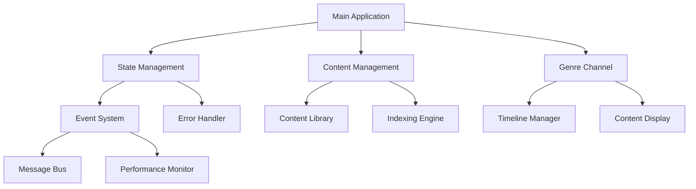
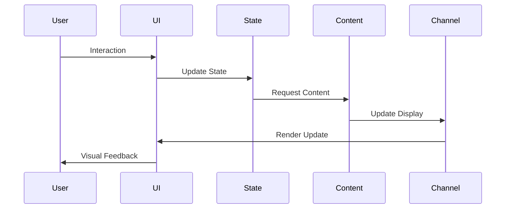
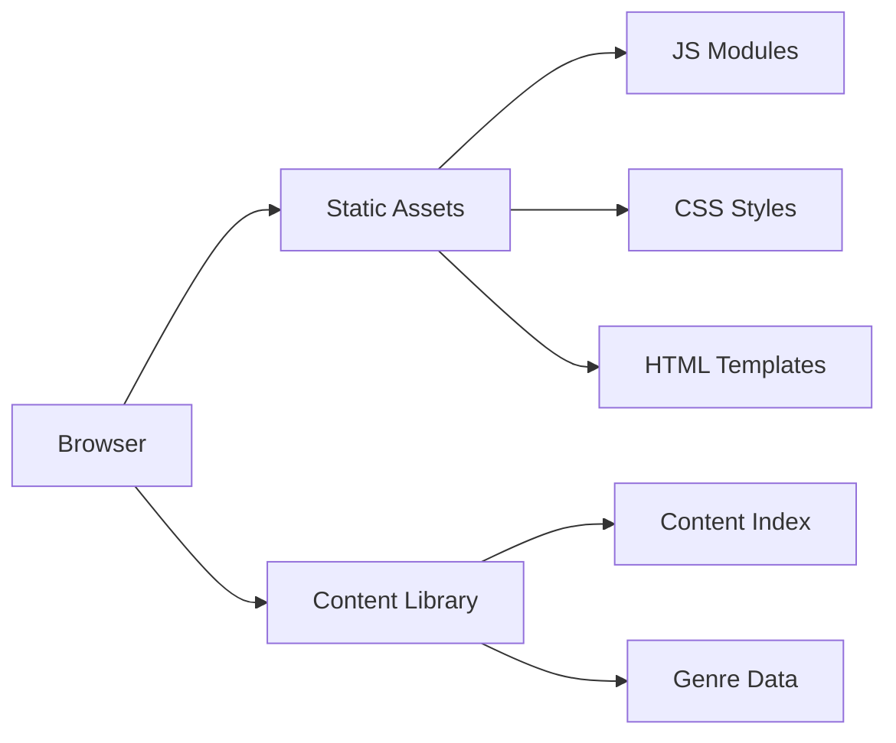

# RUMI Project Architecture

## System Overview

The RUMI project is a modular web application designed for content indexing and genre channel management. The system is built with a focus on performance, maintainability, and scalability.



## Core Components

### 1. State Management System (`js/core/state-management.js`)
- Centralized state store
- Event-driven updates
- History tracking
- State validation
- Conflict resolution

### 2. Animation Engine (`js/core/animation-engine.js`)
- Frame-based animation system
- Performance optimization
- Batch processing
- Adaptive frame rate
- Memory management

### 3. Performance Monitor (`js/core/performance-monitor.js`)
- Metric tracking
- Threshold monitoring
- Statistical analysis
- Performance optimization
- Resource management

### 4. Message Bus (`js/core/message-bus.js`)
- Event distribution
- Priority queuing
- Error handling
- Message validation
- Subscription management

## Backend Systems

### 1. Content Manager (`js/backend/content-manager.js`)
- Content library management
- Filtering and search
- Caching strategy
- Data validation
- Content optimization

### 2. Indexing Engine (`js/core/indexing-engine.js`)
- Content indexing
- Progress tracking
- Block management
- Performance optimization
- State synchronization

### 3. Error Handler (`js/core/error-handling.js`)
- Error recovery
- Logging system
- Recovery strategies
- Context tracking
- Degradation management

## Channel System

### 1. Timeline Manager (`js/channel/timeline-manager.js`)
- Block progression
- Time tracking
- Content synchronization
- State management
- Performance optimization

### 2. Content Display (`js/channel/content-display.js`)
- Content rendering
- Animation management
- State synchronization
- Error handling
- Performance optimization

## UI Components (`js/ui/components.js`)
- Modular components
- Event handling
- State integration
- Animation system
- Error display

## Data Flow



## State Management

### State Structure
```typescript
interface RumiState {
    // Core state
    isActive: boolean
    isIndexing: boolean
    isPaused: boolean
    
    // Session state
    sessionStartTime: number | null
    sessionDuration: number
    
    // Content state
    currentContent: ContentItem | null
    contentQueue: ContentItem[]
    
    // Channel state
    channelActive: boolean
    channelProgress: number
    
    // Performance state
    performanceMetrics: MetricData
    errorState: ErrorState | null
}
```

### State Updates
1. All updates flow through central state manager
2. Updates are validated before application
3. History is maintained for debugging
4. Events are emitted for changes
5. Conflicts are resolved automatically

## Performance Optimization

### Strategies
1. **Batch Processing**
   - Animation frames
   - DOM updates
   - State changes
   - Event processing

2. **Memory Management**
   - Object pooling
   - Garbage collection
   - Cache management
   - Resource cleanup

3. **Event Optimization**
   - Event delegation
   - Throttling
   - Debouncing
   - Priority handling

4. **Resource Loading**
   - Lazy loading
   - Preloading
   - Caching
   - Asset optimization

## Error Handling

### Recovery Strategies
1. **Network Errors**
   - Automatic retry
   - Offline mode
   - Data caching
   - State preservation

2. **State Errors**
   - State rollback
   - Conflict resolution
   - Data validation
   - State reconstruction

3. **Resource Errors**
   - Graceful degradation
   - Alternative resources
   - Error feedback
   - Recovery options

## Security Considerations

### Data Protection
1. Input validation
2. Content sanitization
3. Error masking
4. State validation

### Resource Protection
1. Rate limiting
2. Resource quotas
3. Error thresholds
4. Access control

## Testing Strategy

### Unit Tests
- Component isolation
- State management
- Error handling
- Performance metrics

### Integration Tests
- Component interaction
- State flow
- Error recovery
- Performance impact

### Performance Tests
- Load testing
- Memory usage
- CPU utilization
- Network impact

## Deployment Architecture



## Future Considerations

### Scalability
1. Module federation
2. Dynamic loading
3. State partitioning
4. Resource optimization

### Maintainability
1. Code documentation
2. Performance monitoring
3. Error tracking
4. State debugging

### Extensibility
1. Plugin system
2. Event hooks
3. Custom handlers
4. State extensions 